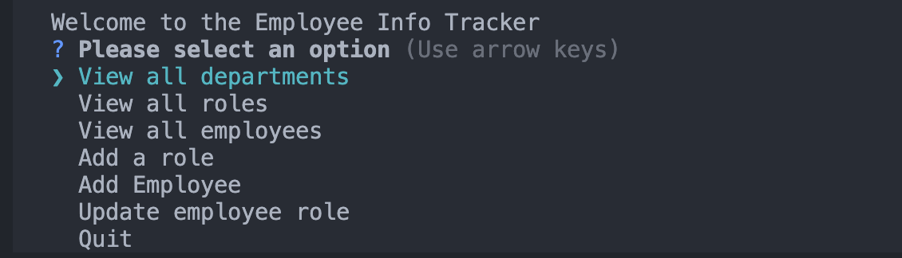
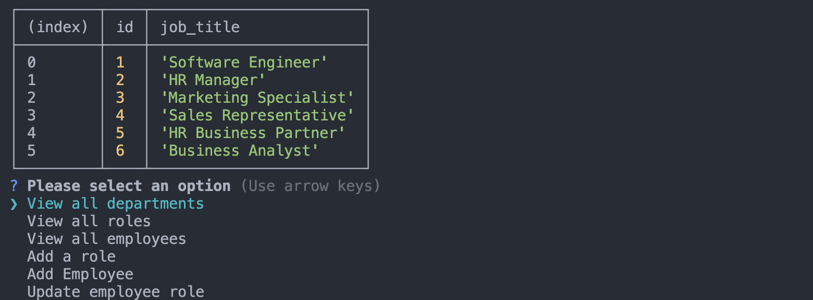
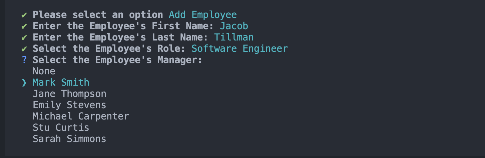
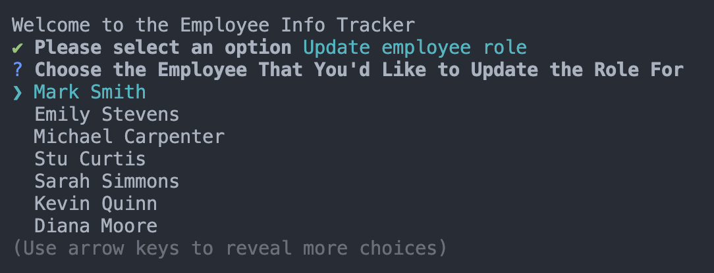
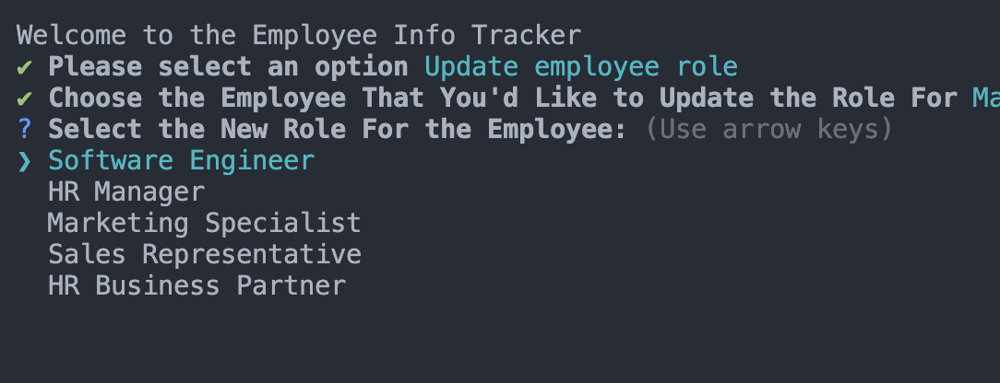

# Employee Tracker Database Application

## Table of Contents
- [Installation](#installation)
- [Usage](#usage)
- [Contributing](#contributing)
- [Tests](#tests)
- [Questions](#questions)
- [License](#license)

## Description
The Employee Tracker Database Application is used to help you keep up to date information on all of the employees within your organization. You can add employee information, such as employee ID, full name, role, and manager. You are also able to add department information and role information. You will automatically be given a list of existing departments/roles when creating an employee, so you can easily select the relevant information for that employee.

## Installation
This program uses console.table, inquirer, and pg. These packages can be installed by running the commands below:
npm i console.table
npm i inquirer
npm i pg

## Usage

Video Walkthrough can be found [!here](https://drive.google.com/file/d/1jhjqcJIF4DKjg5FXgH1h6T3m4VYIDvIg/view?usp=sharing)

To start the application, type npm start into your terminal. Here is a screenshot of how the menu prompt will look.

If you'd like to view existing departments, roles, or employees, you can select the corresponding option. You will then see the relevant information for the option you selected. Screenshot can be seen below for further reference:
If you'd like to add a role to your database, choose the "Add a role option". You will be prompted to add the name of the role, the salary information, and the corresponding department. Please see the screenshot below for an example.

To add a new employee, chose Add Employee from the list. You will be prompted to enter the employee's information, as shown in the screenshot below:

You can also update an existing employee's role. When choosing this option, you will be prompted with a list of employees in your organization. Click their corresponding employee to update the role from the list of roles that is prompted. Two screenshots can be found below for reference:

Simply choose 'Quit' from the main menu to exit the application.

## Contributing
N/A

## Tests
You can use the prompt npm run build to compile the changes you've made and then test them in the application. Please be sure to revert your changes if you do not wish to keep these most recent updates.

## Questions
If you have any questions, please reach out to me through GitHub 

## License
This project is listed under the MIT [License](https://opensource.org/licenses/MIT). You are free to use, modify, and distribute this software in accordance with the terms of the license. For more details, please refer to the LICENSE file in the repository.
